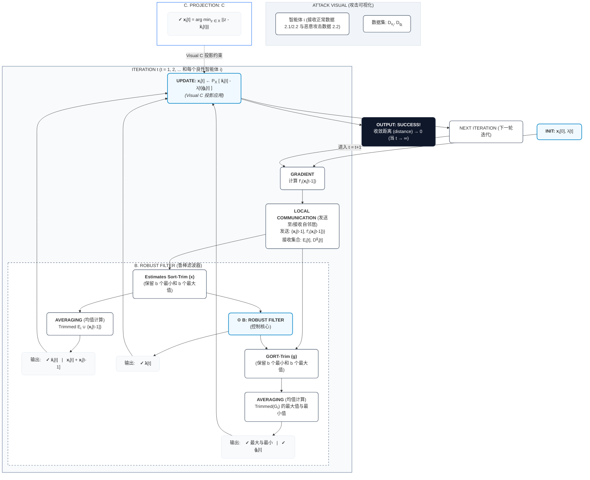

```mermaid

flowchart TD
    %% 样式定义
    classDef default fill:#ffffff,stroke:#475569,stroke-width:1.5px,rx:8px,ry:8px;
    classDef container fill:#f8fafc,stroke:#cbd5e1,stroke-width:2px,stroke-dasharray: 0;
    classDef filterContainer fill:#ffffff,stroke:#94a3b8,stroke-width:1.5px,stroke-dasharray: 5 5;
    classDef highlight fill:#f0f9ff,stroke:#0284c7,stroke-width:2px;
    classDef dark fill:#0f172a,stroke:#1e293b,stroke-width:2px,color:#ffffff;
    classDef formula fill:#f8fafc,stroke:#e2e8f0,stroke-width:1px;

    %% 外部顶层初始化
    init["<b>INIT:</b> <b>x</b><sub>i</sub>[0], &lambda;[t]"]:::highlight

    %% 迭代主区域容器
    subgraph Iteration ["ITERATION t (t = 1, 2, ... 和每个良性智能体 i)"]
        gradient["<b>GRADIENT</b><br/>计算 f'<sub>i</sub>(<b>x</b><sub>i</sub>[t-1])"]
        
        comm["<b>LOCAL COMMUNICATION</b> (发送至/接收自邻居)<br/>发送: {<b>x</b><sub>i</sub>[t-1], f'<sub>i</sub>(<b>x</b><sub>i</sub>[t-1])}<br/>接收集合: E<sub>i</sub>[t], D<sup>g</sup><sub>i</sub>[t]"]

        %% 鲁棒滤波器子图 (对应 dashed Box B)
        subgraph RobustFilter ["B. ROBUST FILTER (鲁棒滤波器)"]
            %% 左半侧：状态估计分支
            est_trim["<b>Estimates Sort-Trim (x)</b><br/>(保留 b 个最小和 b 个最大值)"]
            est_avg["<b>AVERAGING</b> (均值计算)<br/>Trimmed E<sub>i</sub> &cup; {<b>x</b><sub>i</sub>[t-1]}"]
            est_out["输出: &nbsp;&nbsp; <b>✓ x̃</b><sub>i</sub>[t] &nbsp;&nbsp;|&nbsp;&nbsp; <b>x</b><sub>i</sub>[t] + <b>x</b><sub>i</sub>[t-1]"]:::formula
            
            %% 中间核心：滤波器参数控制
            gear["⚙️ <b>B: ROBUST FILTER</b><br/>(控制核心)"]:::highlight
            lambda_out["输出: &nbsp;&nbsp; <b>✓ &lambda;</b>[t]"]:::formula

            %% 右半侧：梯度分支
            grad_trim["<b>GORT-Trim (g)</b><br/>(保留 b 个最小和 b 个最大值)"]
            grad_avg["<b>AVERAGING</b> (均值计算)<br/>Trimmed(G<sub>i</sub>) 的最大值与最小值"]
            grad_out["输出: &nbsp;&nbsp; <b>✓</b> 最大与最小 &nbsp;&nbsp;|&nbsp;&nbsp; <b>✓ g̃</b><sub>i</sub>[t]"]:::formula
        end

        update["<b>UPDATE:</b> <b>x</b><sub>i</sub>[t] &larr; P<sub>X</sub> [ <b>x̃</b><sub>i</sub>[t] - &lambda;[t]<b>g̃</b><sub>i</sub>[t] ]<br/><i>(Visual C 投影应用)</i>"]:::highlight
    end

    %% 外部侧边栏：攻击可视化
    subgraph AttackVisual ["ATTACK VISUAL (攻击可视化)"]
        direction TB
        av_nodes["智能体 i (接收正常数据 2.1/2.2 与恶意攻击数据 2.2)"]
        av_vars["数据集: D<sub>x<sub>i</sub></sub>, D<sub>g<sub>i</sub></sub>"]
    end

    %% 外部左下侧：投影区域 C
    subgraph Projection ["C. PROJECTION: C"]
        proj_formula["<b>✓ x</b><sub>i</sub>[t] = arg min<sub>z &isin; X</sub> ||z - <b>x̃</b><sub>i</sub>[t]||"]:::formula
    end

    %% 底部输出与循环
    output["<b>OUTPUT: SUCCESS!</b><br/>收敛距离 (distance) &rarr; 0 (当 t &rarr; &infin;)"]:::dark
    next_iter["NEXT ITERATION (下一轮迭代)"]

    %% 节点连接关系定义
    init --> gradient
    gradient --> comm
    
    comm --> est_trim
    comm --> grad_trim
    
    %% 左分支流动
    est_trim --> est_avg
    est_avg --> est_out
    
    %% 滤波器交互关系
    est_trim --> gear
    gear --> grad_trim
    gear --> lambda_out
    
    %% 右分支流动
    grad_trim --> grad_avg
    grad_avg --> grad_out
    
    %% 汇总更新
    est_out --> update
    lambda_out --> update
    grad_out --> update
    
    %% 外部依赖项与闭环
    Projection -.->|Visual C 投影约束| update
    update --> output
    update --> next_iter
    next_iter -->|进入 t = t+1| gradient

    %% 样式绑定
    style Iteration fill:#f8fafc,stroke:#94a3b8,stroke-width:2px;
    style RobustFilter fill:#ffffff,stroke:#64748b,stroke-width:1.5px,stroke-dasharray: 5 5;
    style AttackVisual fill:#f1f5f9,stroke:#cbd5e1,stroke-width:1px;
    style Projection fill:#ffffff,stroke:#3b82f6,stroke-width:1.5px;
```